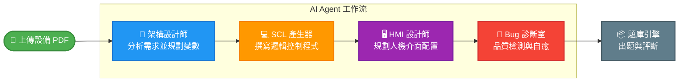

<div align="center">
  <h1>🏭 Smart PLC Studio</h1>
  <p><strong>全能自動化工作站 | Next-Generation Industrial Automation IDE Assistant</strong></p>

  
  
  
  
  

  <p>基於 LLM 型語言模型與 RAG (檢索增強生成) 技術打造的工業級自動化開發輔助系統。</p>
  <p>專為 <b>西門子 TIA Portal</b> 設計，能將自然語言、PDF 規格書瞬間轉化為高品質的 SCL 程式碼與變數表。</p>
</div>

---

## 📖 目錄 (Table of Contents)
- [✨ 核心特色 (Key Features)](#-核心特色-key-features)
- [🧩 多代理工作流 (Multi-Agent Orchestration)](#-多代理工作流-multi-agent-orchestration)
- [🚀 快速啟動 (Quick Start)](#-快速啟動-quick-start)
  - [先決條件 (Prerequisites)](#先決條件-prerequisites)
  - [使用 Docker 部署 (推薦)](#方法一使用-docker-compose-一鍵部署-推薦-)
  - [本地端運行](#方法二本地端直接執行-local-setup)
- [📂 專案結構 (Project Structure)](#-專案結構-project-structure)
- [🛠️ 技術棧 (Tech Stack)](#️-技術棧-tech-stack)

---

## ✨ 核心特色 (Key Features)

| 模組 | 說明 |
| --- | --- |
| **📝 SCL 智能生成與教學** | 輸入自然語言需求，自動產出具備新手教學的 SCL 邏輯區塊，並嚴格遵守 IO 隔離與語法鐵律。 |
| **🛠️ Bug 診療室** | 貼上編譯報錯或問題程式碼，AI 專家自動診斷漏洞並提供完美修復方案與修改建議。 |
| **⚙️ 進階工藝控制** | 專為 `PID_Compact`、`Motion Control` 等複雜工藝物件與進階數學運算量身打造的生成服務。 |
| **📦 批次題庫引擎** | 結合 RAG 與手冊知識庫，一鍵量產數百題工業標準測試腳本與 QA 題庫，並支援匯出為 Excel 檔案。 |
| **📄 PDF 考題破解器** | 上傳系統規格書或技能競賽術科 PDF，透過多模態視覺解析，自動梳理流程並生成完整的 PLC 程式碼與架構。 |

---

## 🧩 多代理工作流 (Multi-Agent Orchestration)

Smart PLC Studio 不僅提供單一工具，更支援 **全自動化的 AI 協作流水線**。使用者可一鍵串接所有模組（如：從「分析 PDF 規格書」到「產出完整 SCL、HMI 規劃及題庫」）。



> **💡 提示**: 在系統側邊欄選擇 **🧩 多代理工作流**，可查看並執行完整流程。詳情請參考 `ui.py` 與 `workflows/`。

---

## 🚀 快速啟動 (Quick Start)

### 先決條件 (Prerequisites)
- [Python 3.10+](https://www.python.org/downloads/) (若選擇本地執行)
- [Docker & Docker Compose](https://www.docker.com/) (若選擇容器化執行)
- 一組有效的 **Gemini API Key** (請至 [Google AI Studio](https://aistudio.google.com/) 申請)

### 方法一：使用 Docker Compose 一鍵部署 (推薦 ⭐)

Docker 能確保應用程式執行環境與相依套件的一致性，是最穩定的啟動方式。

1. **設定環境變數**  
   複製環境變數範本並填寫您的 API Key：
   ```bash
   cp .env.example .env
   ```
   *請編輯 `.env` 檔案，將 `your_api_key_here` 替換為真實的 Gemini API Key。*

2. **啟動 Docker 服務**
   ```bash
   docker compose up -d --build
   ```
   *(停止服務時請使用 `docker compose down`)*

3. **初始化 Chroma 向量資料庫（選擇性）**  
   若需使用 PDF 破題或手冊 RAG 功能，請先確保 `data/manuals/` 資料夾內有對應的 PDF 檔案，接著請先進入服務內部，再執行腳本：
   ```bash
   docker compose exec smart-plc-studio python scripts/build_vector_db.py
   ```

4. **開啟應用程式**  
   打開瀏覽器前往：[http://localhost:8501](http://localhost:8501)

### 方法二：本地端直接執行 (Local Setup)

1. **安裝相依套件**
   ```bash
   pip install -r requirements.txt
   ```
2. **初始化 Chroma 向量資料庫（選擇性）**
   ```bash
   python scripts/build_vector_db.py
   ```
3. **啟動 Streamlit 服務**
   ```bash
   streamlit run ui.py
   ```

---

## 📂 專案結構 (Project Structure)

```text
Smart-PLC-Studio/
├── agents/                 # 多代理工作流 (Agents) 核心邏輯
├── core/                   # 系統核心服務與設定
├── data/
│   └── manuals/            # 西門子說明手冊 PDF (供 RAG 使用)
├── scripts/
│   └── build_vector_db.py  # Chroma 向量庫建置腳本
├── services/               # 整合 LLM、ChromaDB 等外部 API
├── workflows/              # 工作流定義
├── ui.py                   # Streamlit 主程式入口
├── requirements.txt        # Python 依賴包列表
├── Dockerfile              # Docker 映像檔建置配置
└── docker-compose.yml      # Docker 整合部署配置
```

---

## 🛠️ 技術棧 (Tech Stack)

- **Frontend & UI**: [Streamlit](https://streamlit.io/)
- **LLM Engine**: [Google Gemini 2.5](https://deepmind.google/technologies/gemini/) (`google-genai` SDK)
- **Vector Database**: [ChromaDB](https://www.trychroma.com/)
- **Data Processing**: [Pandas](https://pandas.pydata.org/), [OpenPyXL](https://openpyxl.readthedocs.io/)
- **Containerization**: [Docker](https://www.docker.com/)

---

<div align="center">
  <p><i>💡 "Automating the Automation" 讓 PLC 開發不再是刻板的重複勞動。</i></p>
</div>