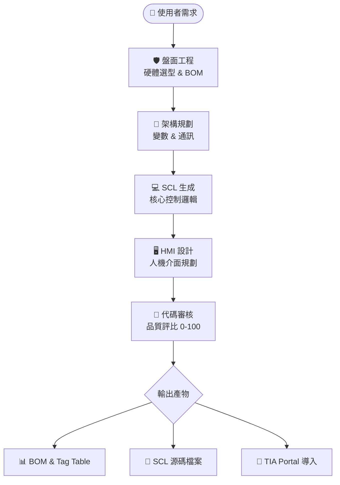

<div align="center">
  <h1>🏭 Smart PLC Studio</h1>
  <p><strong>工業自動化 AI 智能工作站 | Next-Generation Industrial Automation AI Orchestrator</strong></p>

  
  
  
  

  <p>基於多代理網路 (Multi-Agent) 與 RAG 技術打造的 <b>全流程 PLC 開發輔助系統</b>。<br>
  從硬體選型、架構規劃到程式碼生成與 TIA Portal 一鍵導入，徹底實現「自動化開發的自動化」。</p>
</div>

---

## 📖 目錄 (Table of Contents)
- [✨ 核心亮點 (Core Highlights)](#-核心亮點-core-highlights)
- [🤖 AI 代理矩陣 (AI Agents Matrix)](#-ai-代理矩陣-ai-agents-matrix)
- [🧩 自動化流水線 (Workflow)](#-自動化流水線-workflow)
- [🚀 快速啟動 (Quick Start)](#-快速啟動-quick-start)
- [📂 專案結構 (Project Structure)](#-專案結構-project-structure)
- [🛠️ 技術棧 (Tech Stack)](#️-技術棧-stack)

---

## ✨ 核心亮點 (Core Highlights)

| 特色 | 說明 |
| --- | --- |
| **📦 智慧盤面工程** | 透過 AI 自動進行 PLC (S7-1200/1500) 與 HMI (KTP/TP) 選型，並生成詳細的 BOM 表與控制箱線框圖。 |
| **📜 SCL 全自動生成** | 嚴格遵守 Siemens SCL 語法鐵律與 IO 隔離設計原則，將自然語言描述轉化為可立即執行的程式塊。 |
| **🔌 TIA Portal 整合** | 整合 C# Openness API，支援將生成的 SCL 邏輯與標記一鍵導入至 TIA Portal 專案。 |
| **🛡️ 自動工安稽核** | 具備「自我修復」機制，偵測到如馬達未互鎖等安全隱患時，會自動退回上一部修正並重新產出。 |
| **🔎 量化代碼審核** | 內建 AI Code Reviewer，針對生成的程式碼進行 0-100 評分，並提供詳細的修改建議。 |
| **📄 RAG 規格書破題** | 透過讀取 Siemens 官方手冊或專案規格書 PDF，構建局部知識鏈結，讓 AI 更懂特定設備細節。 |

---

## 🤖 AI 代理矩陣 (AI Agents Matrix)

Smart PLC Studio 由多個專業 Agent 個體協作組成：

- **🛡️ 盤面工程師 (Panel Engineer)**: 負責硬體選型、BOM 表產出 (Excel) 及盤面空間規劃。
- **🧠 架構設計師 (Architecture Designer)**: 分析需求，定義數值交換協定與變數表 (Tag Table)。
- **💻 SCL 產生器 (Generator)**: 負責核心邏輯編寫，支援工藝物件 (PID, Motion Control) 配置。
- **🖥️ HMI 設計師 (HMI Designer)**: 規劃操作畫面佈點、警報訊息與趨勢圖配置。
- **🛡️ 工安稽核員 (Safety Auditor)**: 偵測潛在工安隱患（如互鎖缺失、急停無優先權），具有自動修正程式碼的否決權。
- **🕵️ 程式診斷與審核 (Bug Clinic & Reviewer)**: 執行語法除錯、代碼優化建議與品質評分。

---

## 🧩 自動化流水線 (Workflow)



---

## 🚀 快速啟動 (Quick Start)

### 先決條件 (Prerequisites)
- **API Key**: 準備好您的 [Google AI Studio](https://aistudio.google.com/) API Key。
- **TIA Portal**: 若需使用導入功能，需安裝 TIA Portal 並啟用 Openness。

### 方法一：使用 Docker 部署 (推薦)
1. 複製並設定環境變數：
   ```bash
   cp .env.example .env
   # 在 .env 中填入 GOOGLE_API_KEY
   ```
2. 啟動服務：
   ```bash
   docker compose up -d --build
   ```
3. 存取：`http://localhost:8501`

### 方法二：本地端開發模式
1. 安裝環境：
   ```bash
   pip install -r requirements.txt
   ```
2. 啟動 UI：
   ```bash
   streamlit run ui.py
   ```

---

## 📂 專案結構 (Project Structure)

- `agents/`: 各專業領域 AI Agent 的 Prompt 與邏輯定義。
- `core/`: 系統 UI 樣式 (`ui_styles.py`) 與全域設定。
- `data/`: 包含 `plc_catalog.json`、`hmi_catalog.json` 與 RAG 參考手冊。
- `tools/`: 整合 TIA Portal 的 C# Openness 程序 (`ImportSCL.exe`)。
- `workflows/`: 調度多代理協作的 `orchestrator_ui.py`。

---

## 🛠️ 技術棧 (Tech Stack)

- **UI**: Streamlit
- **LLM**: Google Gemini 2.0 Flash
- **Logic**: Python 3.10+
- **Database**: ChromaDB (Vector Search for RAG)
- **TIA Integration**: C# / TIA Openness API

---

<div align="center">
  <i>"Transforming abstract requirements into industrial precision."</i>
</div>